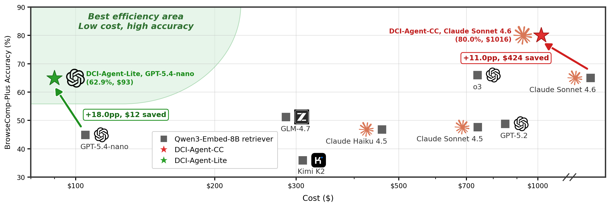

<a name="readme-top"></a>

<p align="center">
  
</p>

<p align="center">
  Beyond Semantic Similarity: Rethinking Retrieval for Agentic Search via Direct Corpus Interaction
</p>

---

## 💥 Introduction

**DCI** is a direct corpus interaction paradigm for agentic search. Instead of querying a fixed semantic retriever or retrieval API, the agent searches the raw corpus directly with terminal tools. This lets the agent freely compose search primitives and interact with the corpus as an open research environment. It also substantially simplifies the overall retrieval system. 

**DCI-Agent-Lite** is the minimal open implementation of this paradigm, built on [Pi](https://github.com/badlogic/pi-mono/tree/main/packages/coding-agent) with bash tools and lightweight context management for long-horizon deep research. With `GPT-5.4-nano`, it achieves an impressive 62.9% accuracy on BrowseComp-Plus, surpassing retrieval-agents powered by `GPT-5.2`, `Claude-Sonnet-4.6`, `Qwen3.5-122B`, and `GLM-4.7`.

<div align="center">
  
</div>

<br>

## 🏆 Main Results


## 🌟 Key Features
- 🔒 **Your private deep-research assistant**: Point DCI-Agent-Lite at a local corpus and start immediately. It searches, inspects, cross-checks, and answers from your own knowledge base without sending documents to a hosted retrieval service.
- ⚡ **High-resolution, zero-index retrieval**: No embeddings, vector databases, or offline index builds. The agent searches raw files directly with terminal commands like `rg`, `find`, and `sed`, so it can start immediately and maintain fine-grained control over the knowledge base.
- 🛠️ **Minimal harness, long-horizon power**: Built on [Pi](https://github.com/badlogic/pi-mono/tree/main/packages/coding-agent) with only bash tools and lightweight context management, DCI-Agent-Lite is small enough to hack and strong enough for serious deep research runs.
- 🚀 **Remarkable agentic-search performance**: DCI-Agent-Lite with GPT-5.4-nano beats top baselines across 13 benchmarks, spanning BrowseComp-Plus, knowledge-intensive QA, and IR ranking.

---

## 📑 Table of Contents

- [⚙️ Setup](#setup)
- [⚡ Quick Start](#quick-start)
- [🚀 Running Experiments](#running-experiments)
- [🎯 Benchmark Evaluation](#benchmark-evaluation)
- [🏗️ Repository Layout](#repository-layout)
- [🙏 Acknowledgements](#acknowledgements)
- [📚 Citation](#citation)

---

<a name="setup"></a>
## ⚙️ Setup

### One-Click Install

**Unix / macOS**

```bash
bash setup.sh
```

<details>
<summary>Manual Steps</summary>

See [`assets/docs/setup.md`](assets/docs/setup.md) for detailed prerequisites, repo build instructions, API-key configuration, and vLLM provider setup.

Quick manual path:

```bash
# 1. Install uv + ripgrep, then sync Python deps
uv sync

# 2. Clone and build Pi
git clone https://github.com/jdf-prog/pi-mono.git pi-mono
cd pi-mono && git checkout codex/context-management-ablation && npm install && npm run build && cd ..

# 3. Configure API keys (copy template, edit .env, auto-loaded by setup.sh)
cp .env.template .env
# edit .env, then re-run setup.sh or source it manually

# 4. Download datasets (auto-downloaded by setup.sh, or run manually)
#    Corpus: https://huggingface.co/datasets/DCI-Agent/corpus
uv run python scripts/download_corpus.py

#    Benchmark datasets: https://huggingface.co/datasets/DCI-Agent/dci-bench
uv run python scripts/download_dci_bench.py
```

</details>

### Configuration

Copy the template to `.env`, then fill in the variables you need. To get DCI running, set at least one of `OPENAI_API_KEY` or `ANTHROPIC_API_KEY`:

```bash
cp .env.template .env
```

Common variables:

- `OPENAI_API_KEY` for OpenAI model runs and benchmark judging by default.
- `ANTHROPIC_API_KEY` for Anthropic model runs.

<a name="quick-start"></a>
## ⚡ Quick Start

**Prerequisites**: Install dependencies and configure an OpenAI API key (see [Setup](#setup)).

The example below illustrates DCI-Agent-Lite in action: the deep research agent searches the corpus, inspects relevant documents, and produces evidence-grounded answers entirely within the given wikipedia corpus.

1. **Open the DCI-Agent-Lite TUI**:

```bash
# load keys from .env if not already in environment
set -a; source .env 2>/dev/null; set +a

uv run dci-agent-lite --terminal \
  --provider openai \
  --model gpt-5.4-nano \
  --cwd "corpus/wiki_corpus" \
  --extra-arg="--thinking high"
```

2. **Run your first task**. In the TUI, type:

```text
Answer the following question using only wiki_dump.jsonl in the current directory. Do not use web search. Use rg instead of grep for fast searching. Question: In which street did the Great Fire of London originate?
```

3. (Optional) **Run Programmatically from the CLI**. Remove the `--terminal` flag and pass your task as the final argument:

```bash
set -a; source .env 2>/dev/null; set +a

uv run dci-agent-lite \
  --provider openai \
  --model gpt-5.4-nano \
  --cwd "corpus/wiki_corpus" \
  --extra-arg="--thinking high" \
  "Answer the following question using only wiki_dump.jsonl in the current directory. Do not use web search. Use rg instead of grep for fast searching. Question: In which street did the Great Fire of London originate?"
```

Programmatic runs save artifacts under `outputs/runs/<timestamp>/`. The final answer is in `final.txt`, the original question is in `question.txt`, and the full trajectory is in `conversation_full.json`. To choose a specific location, pass `--output-dir path/to/run`. 

More runnable examples for OpenAI, Anthropic and vLLM are available in [`scripts/examples/`](scripts/examples/) as `dci_basic_*.sh`. See the [setup guide](assets/docs/setup.md#5-optional-configure-a-local-vllm-provider) for vLLM configuration.


## 🚀 Context Management Strategies

DCI-Agent-Lite includes a lightweight runtime context-management layer for long-horizon deep research runs.

It uses three simple strategies:

- **Truncation** shortens large tool results in each turn.
- **Compaction** keeps recent turns and replaces older tool results with placeholders.
- **Summarization** summarizes older history when the context gets crowded.

The runtime levels move from no context management to more aggressive compression:

| Level | Behavior |
|-------|----------|
| `level0` | No context management. |
| `level1` | Light truncation. |
| `level2` | Stronger truncation. |
| `level3` | Truncation and compaction. |
| `level4` | Truncation, compaction, and summarization. |

Pass a level through Pi with `--extra-arg`:

```bash
set -a; source .env 2>/dev/null; set +a

uv run dci-agent-lite \
  --provider openai \
  --model gpt-5.4-nano \
  --cwd "corpus/wiki_corpus" \
  --extra-arg="--thinking high" \
  --extra-arg="--context-management-level level4" \
  "Answer the following question using only wiki_dump.jsonl in the current directory. Do not use web search. Use rg instead of grep for fast searching. Question: In which street did the Great Fire of London originate?"
```


<a name="running-experiments"></a>
## 🎯 Benchmark DCI-Agent-Lite 

We benchmark DCI-Agent-Lite on the following benchmark suites using OpenAI `gpt-5.4-nano` with `--thinking high`, context management set to `level3`, and a maximum turn budget of 300.

| Data | Data Size | Retrieval Corpus | Corpus Size | Avg. Corpus Len. (words) | Corpus Path |
|------|-----------|------------------|-------------|--------------------------|-------------|
| BrowseComp-Plus | 830 | BrowseComp-Plus | 100,195 docs | 5,179 | `corpus/bc_plus_docs/` |
| BRIGHT-Biology | 103 | BRIGHT-Biology | 57,359 docs | 48 | `corpus/bright_corpus/biology/` |
| BRIGHT-Earth Science | 116 | BRIGHT-Earth Science | 121,249 docs | 28 | `corpus/bright_corpus/earth_science/` |
| BRIGHT-Economics | 103 | BRIGHT-Economics | 50,220 docs | 52 | `corpus/bright_corpus/economics/` |
| BRIGHT-Robotics | 101 | BRIGHT-Robotics | 61,961 docs | 25 | `corpus/bright_corpus/robotics/` |
| NQ, TriviaQA, Bamboogle, HotpotQA, 2WikiMultiHopQA, MuSiQue | 50 each / 300 total | Wikipedia-18 | 21,015,324 docs | 100 | `corpus/wiki_corpus/` |


### Agentic Search (BrowseComp-Plus)

```bash
bash scripts/bcplus_eval/run_bcplus_eval_openai.sh
```

### Knowledge-Intensive QA

```bash
bash scripts/qa/run_hotpotqa_dev_sample50.sh
bash scripts/qa/run_musique_dev_sample50.sh
bash scripts/qa/run_nq_test_sample50.sh
bash scripts/qa/run_triviaqa_test_sample50.sh
bash scripts/qa/run_2wikimultihopqa_dev_sample50.sh
bash scripts/qa/run_bamboogle_test_sample50.sh
```

### IR Ranking

```bash
# BRIGHT
bash scripts/bright/run_bio.sh
bash scripts/bright/run_earth_science.sh
bash scripts/bright/run_economics.sh
bash scripts/bright/run_robotics.sh
```

<a name="acknowledgements"></a>
## 🙏 Acknowledgements

<!-- TODO: fill in acknowledgements -->

---

<a name="citation"></a>
## 📚 Citation

```bibtex
@misc{dci2025,
  title = {DCI: High-Resolution Corpus Interaction},
  author = {Placeholder},
  year = {2025}
}
```

<p align="right"><a href="#readme-top">↑ Back to Top ↑</a></p>
